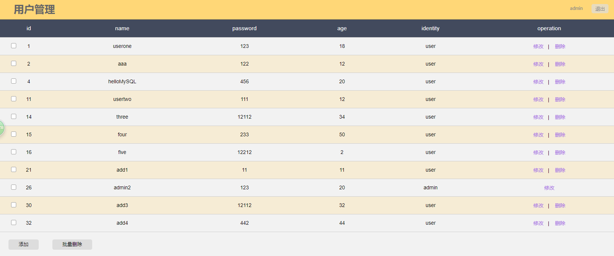

express实现简单的mysql操作
====

### 1.安装node+express+mysql环境

### 2.生成express项目
其中：

│  app.js -相当于main文件

│  package-lock.json

│  package.json

├─bin -启动应用

├─node_modules

├─public -存放静态资源目录

├─routes -路由,相当于Controller

└─views -模板文件所在目录,相当于视图

### 3.新建文件夹models存放数据库配置文件
一个文件存放数据库的配置信息；一个文件存放一个表的sql语句；

### 4.新建路由并实现接口
在路由中导入mysql模块并连接数据库进行操作；

### 5.实现登录验证
可以配置 express-session，方便处理session

npm install express-session --save

根据session设置拦截器，退出登录时清空session

### 6.前端使用ejs模板引擎
ps:退出登陆和批量操作还需修改

### 由于该项目主要用来练习操作mysql，所以模块比较简单：
登录页：

管理页：

